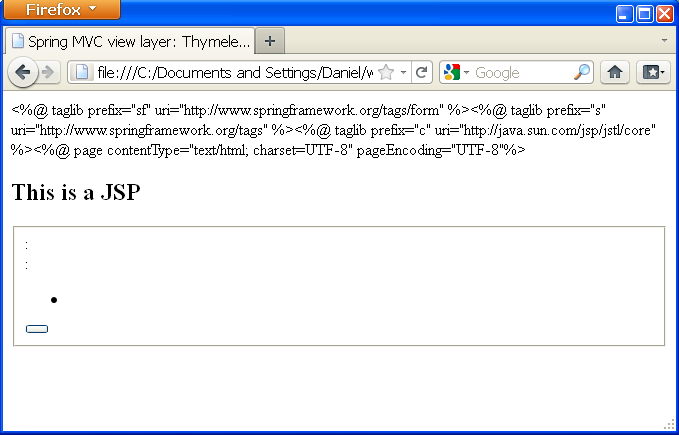
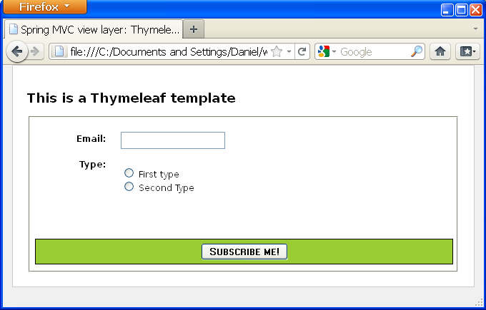

title: Thymeleaf 101
output: index.html
controls: false
progress: false


-- cover

# Thymeleaf 101
## http://ir.gl/thymeleaf-101

-- 

# marcos abel
## marcos.abel@trabesoluciones.com

-- image


--
## NOTA: parte de los materiales de esta charla están tomados y/o adaptados (con permiso del autor) de la documentación oficial del proyecto disponible en http://www.thymeleaf.org/  

-- bullets toc bullets-first

## De qué vamos a hablar

* Qué es thymeleaf y qué tiene que ver con natural templating
* Qué pinta tiene thymeleaf. Componentes básicos
* Atributos básicos
* Layouts
* Configurar Spring MVC para utilizar Thymeleaf como capa vista

-- section

## Qué es thymeleaf


--

* Librería java. Open source ;)
* Motor de plantillas XML / HTML / HTML5
* Utilizable de forma "independiente" 
* Intergración "out of the box" con Spring MVC
* Extensible. Framework de motores de plantillas
* Soporte para natural templating

--

## ¿natural what?

--

## Natural Templating

Las plantillas de la aplicación deberían ser prototipos válidos para trabajar sobre ellos e idealmente visualizables en un navegador sin necesidad de ser procesadas. 

-- 
## "Natural templating" en jsp (I/II)

```xml
<%@ taglib prefix="sf" uri="http://www.springframework.org/tags/form" %>
<%@ taglib prefix="s" uri="http://www.springframework.org/tags" %>
<%@ taglib prefix="c" uri="http://java.sun.com/jsp/jstl/core" %>
<%@ page contentType="text/html; charset=UTF-8" pageEncoding="UTF-8"%>
<!DOCTYPE html>
 
<html>
 
  <head>
    <title>Spring MVC view layer: Thymeleaf vs. JSP</title>
    <meta http-equiv="Content-Type" content="text/html; charset=UTF-8" />
    <link rel="stylesheet" type="text/css" media="all" href="<s:url value='/css/thvsjsp.css' />"/>
  </head>
 
  <body>
 
    <h2>This is a JSP</h2>
 
    <s:url var="formUrl" value="/subscribejsp" />
    <sf:form modelAttribute="subscription" action="${formUrl}">
 
      <fieldset>
 
        <div>
          <label for="email"><s:message code="subscription.email" />: </label>
          <sf:input path="email" />
        </div>
```

--

## "Natural templating" en jsp (II/II)

```xml
        <div>
          <label><s:message code="subscription.type" />: </label>
          <ul>
            <c:forEach var="type" items="${allTypes}" varStatus="typeStatus">
              <li>
                <sf:radiobutton path="subscriptionType" value="${type}" />
                <label for="subscriptionType${typeStatus.count}">
                  <s:message code="subscriptionType.${type}" />
                </label>
              </li>
            </c:forEach>
          </ul>
        </div>
 
        <div class="submit">
          <button type="submit" name="save"><s:message code="subscription.submit" /></button>
        </div>
 
      </fieldset>
 
    </sf:form>
 
  </body>
 
</html>
```

-- image




-- image


-- image


--

## Natural templating con thymeleaf (I/II)

```xml
<DOCCTYPE html>
 
<html xmlns:th="http://www.thymeleaf.org">
 
  <head>
    <title>Spring MVC view layer: Thymeleaf vs. JSP</title>
    <meta http-equiv="Content-Type" content="text/html; charset=UTF-8" />
    <link rel="stylesheet" type="text/css" media="all"
      href="../../css/thvsjsp.css" th:href="@{/css/thvsjsp.css}"/>
  </head>
 
  <body>
 
    <h2>This is a Thymeleaf template</h2>
 
    <form action="#" th:object="${subscription}" th:action="@{/subscribeth}">
 
      <fieldset>
 
        <div>
          <label for="email" th:text="#{subscription.email}">Email: </label>
          <input type="text" th:field="*{email}" />
        </div>
```
--


## Natural templating con thymeleaf (II/II)

```xml
        <div>
          <label th:text="#{subscription.type}">Type: </label>
          <ul>
            <li th:each="type : ${allTypes}">
              <input type="radio" th:field="*{subscriptionType}" th:value="${type}" />
              <label th:for="${#ids.prev('subscriptionType')}"
                th:text="#{'subscriptionType.'+${type}}">First type</label>
            </li>
            <li th:remove="all"><input type="radio" /> <label>Second Type</label></li>
          </ul>
        </div>
 
        <div class="submit">
          <button type="submit" name="save" th:text="#{subscription.submit}">Subscribe me!</button>
        </div>
 
      </fieldset>
 
    </form>
 
  </body>
 
</html>

```

-- image



-- image


-- section

## Qué pinta tiene Thymeleaf

--

```xml
<table>
  <thead>
    <tr>
      <th th:text="#{msgs.headers.name}">Name</th>
      <th th:text="#{msgs.headers.price}">Price</th>
    </tr>
  </thead>
  <tbody>
    <tr th:each="prod : ${allProducts}">
      <td th:text="${prod.name}">Oranges</td>
      <td th:text="${#numbers.formatDecimal(prod.price,1,2)}">0.99</td>
    </tr>
  </tbody>
</table>
```
alternativamente
```xml
<table>
    <tr data-th-each="user : ${users}">
        <td data-th-text="${user.login}">...</td>
        <td data-th-text="${user.name}">...</td>
    </tr>
</table>
```
--
## Contexto de una plantilla

```java
public interface IContext {

    public VariablesMap<String,Object> getVariables();
    public Locale getLocale();
    ...
    
}

public interface IWebContext extends IContext {
    
    public HttpSerlvetRequest getHttpServletRequest();
    public HttpSession getHttpSession();
    public ServletContext getServletContext();
    
    public VariablesMap<String,String[]> getRequestParameters();
    public VariablesMap<String,Object> getRequestAttributes();
    public VariablesMap<String,Object> getSessionAttributes();
    public VariablesMap<String,Object> getApplicationAttributes();
    
}
```
--
## Implementación de serie de contexto web

```java
WebContext ctx = 
            new WebContext(request, response, servletContext, request.getLocale());
```

* Add all the request attributes to the context variables map.
* Add a context variable called param containing all the request parameters.
* Add a context variable called session containing all the session attributes.
* Add a context variable called application containing all the ServletContext attributes.

-- section

## Dialecto Standard de thymeleaf

--


## Expresiones
* OGNL (Object-Graph Navigation Language) | SpringEL
* Tienen acceso al contexto global de la plantilla

	```xml
	<div th:text="${session.user.name}"/>
	<li th:each="book : ${books}">
	```
--

## Expresiones asterisco

Se ejecutan sobre un contexto previamente definido 

```xml
<div th:object="${book}">
	<span th:text="*{title}"></span>
</div>
```
--

## Expresiones de externalización de cadenas

* se sustituyen por mensajes localizados, típicamente definidos en ficheros .properties
	
	```xml
	<span th:text="#{app.messages.title}"></span>
	```

--

## Expresiones de urls
* Reescritura de urls, con soporte para parámetros y URLs relativas o absolutas

	```xml
	<form th:action="@{/createOrder(id=${orderId})}">
	<a href="main.html" th:href="@{../main.html}">
	</form>
	```
--

## Literales
* Texto: 'one text', 'Another one!',…
* Números: 0, 34, 3.0, 12.3,…
* Boolean: true, false
* ...…
--

## Comparisons and equality
* Comparators: >, <, >=, <= (gt, lt, ge, le)
* Equality operators: ==, != (eq, ne)
--

## Conditional operators
* If-then: (if) ? (then)
* If-then-else: (if) ? (then) : (else)
* Default: (value) ?: (defaultvalue)

--

## Operations
* Text operations
	* String concatenation: +
	* Literal substitutions: |The name is ${name}|
* Arithmetic operations:
	* Binary operators: +, -, *, /, %
	* Minus sign (unary operator): -
* Boolean operations:
	* Binary operators: and, or
	* Boolean negation (unary operator): !, not

-- section

## atributos básicos

--
## th:text y th:utext

sustituyen el contenido de un tag por el resultado de evaluar la expresiónque contenga el atributo.

```
home.welcome=Welcome to our <b>fantastic</b> grocery store!
```
escapando:
```xml
<p th:text="#{home.welcome}">Welcome to our grocery store!</p>
```

```xml
<p>Welcome to our &lt;b&gt;fantastic&lt;/b&gt; grocery store!</p>
```
sin escapar:
```xml
<p th:utext="#{home.welcome}">Welcome to our grocery store!</p>
```

```xml
<p>Welcome to our <b>fantastic</b> grocery store!</p>
```
--
## th:attr
sustituye el valor de uno o más atributos del tag.
```xml
<input type="submit" value="Subscribe me!" th:attr="value=#{subscribe.submit}"/>

```
--

## th:value, th:action, th:href

```xml
<input type="submit" value="Subscribe me!" th:value="#{subscribe.submit}"/>

<form action="subscribe.html" th:action="@{/subscribe}">

<li><a href="product/list.html" th:href="@{/product/list}">Product List</a></li>
```
--
## th:attrappend, th:attrprepend y th:classappend

```xml
<input type="button"  class="btn" th:attrappend="class=${' ' + cssStyle}" />
```
```xml
<input type="button"  class="btn" th:attrprepend="class=${cssStyle + ' '}" />
```

```xml
<tr th:each="prod : ${prods}" class="row" th:classappend="${prodStat.odd}? 'odd'">
``` 

--

## th:* (I/II)

th:abbr	th:accept th:accept-charset
th:accesskey	th:action	th:align
th:alt	th:archive	th:audio
th:autocomplete	th:axis	th:background
th:bgcolor	th:border	th:cellpadding
th:cellspacing	th:challenge	th:charset
th:cite	th:class	th:classid
th:codebase	th:codetype	th:cols
th:colspan	th:compact	th:content
th:contenteditable	th:contextmenu	th:data
th:datetime	th:dir	th:draggable
th:dropzone	th:enctype	th:for
th:form	th:formaction	th:formenctype
th:formmethod	th:formtarget	th:frame
th:frameborder	th:headers	th:height
th:high	th:href	th:hreflang
th:hspace	th:http-equiv	th:icon
th:id	th:keytype	th:kind
th:label	

--
## th:* (II/II)

th:lang	th:list
th:longdesc	th:low	th:manifest
th:marginheight	th:marginwidth	th:max
th:maxlength	th:media	th:method
th:min	th:name	th:optimum
th:pattern	th:placeholder	th:poster
th:preload	th:radiogroup	th:rel
th:rev	th:rows	th:rowspan
th:rules	th:sandbox	th:scheme
th:scope	th:scrolling	th:size
th:sizes	th:span	th:spellcheck
th:src	th:srclang	th:standby
th:start	th:step	th:style
th:summary	th:tabindex	th:target
th:title	th:type	th:usemap
th:value	th:valuetype	th:vspace
th:width	th:wrap	th:xmlbase
th:xmllang	th:xmlspace	

--
## Atributos con valores fijos en HTML5

Ejemplo:
	
	```xml
	<input type="checkbox" name="active" th:checked="${user.active}" />

	<input type="checkbox" name="active" checked="checked" />

	```
Otros atributos disponibles:

	```
	th:async th:autofocus th:autoplay th:checked th:controls 
	th:declare th:default th:defer th:disabled th:formnovalidate 
	th:hidden th:ismap th:loop th:multiple th:novalidate 
	th:nowrap th:open th:pubdate th:readonly th:required	
	th:reversed th:scoped	th:seamless th:selected

	```
--

## Iteración (I/II)

```java
ProductService productService = new ProductService();
List<Product> allProducts = productService.findAll(); 

WebContext ctx = new WebContext(request, servletContext, request.getLocale());
ctx.setVariable("prods", allProducts);

templateEngine.process("product/list", ctx, response.getWriter());
```
plantilla: 
```xml
<table>
      <tr>
        <th>NAME</th>
        <th>PRICE</th>
        <th>IN STOCK</th>
      </tr>
      <tr th:each="prod : ${prods}">
        <td th:text="${prod.name}">Onions</td>
        <td th:text="${prod.price}">2.41</td>
        <td th:text="${prod.inStock}? #{true} : #{false}">yes</td>
      </tr>
</table>
```
--
## Iteración (II/II)

Objetos iterables
* java.util.List
* java.util.Iterable
* java.util.Map
* Arrays

--
## Evaluación condicional (I/II)

```xml
<a href="comments.html"
   th:href="@{/product/comments(prodId=${prod.id})}" 
   th:if="${not #lists.isEmpty(prod.comments)}">view</a>

<a href="comments.html"
   th:href="@{/comments(prodId=${prod.id})}" 
   th:unless="${#lists.isEmpty(prod.comments)}">view</a>

```

--
## Evalución condicional (II/II)

```xml
<div th:switch="${user.role}">
  <p th:case="'admin'">User is an administrator</p>
  <p th:case="#{roles.manager}">User is a manager</p>
  <p th:case="*">User is some other thing</p>
</div>
```
-- section

## Layouts

-- 
File: footer.html

```xml
<!DOCTYPE html SYSTEM "http://www.thymeleaf.org/dtd/xhtml1-strict-thymeleaf-4.dtd">

<html xmlns="http://www.w3.org/1999/xhtml"
      xmlns:th="http://www.thymeleaf.org">

  <body>
  
    <div th:fragment="copy">
      &copy; 2011 The Good Thymes Virtual Grocery
    </div>
  
  </body>
  
</html>
```
File: index.html

```xml
<body>
  <div th:include="footer :: copy"></div>
</body>
```
--

File: footer.html

```xml
<!DOCTYPE html SYSTEM "http://www.thymeleaf.org/dtd/xhtml1-strict-thymeleaf-4.dtd">

<html xmlns="http://www.w3.org/1999/xhtml"
      xmlns:th="http://www.thymeleaf.org">

  <body>
  
    <div id="copy-id">
      &copy; 2011 The Good Thymes Virtual Grocery
    </div>
  
  </body>
  
</html>
```
File: index.html

```xml
<body>
  <div th:include="footer :: #copy-id"></div>
</body>
```
--
## th:include vs th:replace (I/II)


```xml
<!DOCTYPE html SYSTEM "http://www.thymeleaf.org/dtd/xhtml1-strict-thymeleaf-4.dtd">

<html xmlns="http://www.w3.org/1999/xhtml"
      xmlns:th="http://www.thymeleaf.org">

  <body>
  
    <div th:fragment="copy">
      &copy; 2011 The Good Thymes Virtual Grocery
    </div>
  
  </body>
  
</html>
```
```xml
<body>

  ...

  <div th:include="footer :: copy"></div>
  <div th:replace="footer :: copy"></div>
  
</body>
```

--

## th:include vs th:replace (II/II)


```xml
<body>

  ...

  <div>
    &copy; 2011 The Good Thymes Virtual Grocery
  </div>
  <footer>
    &copy; 2011 The Good Thymes Virtual Grocery
  </footer>
  
</body>
```
--

## Fragmentos con parámetros

```xml
<div th:fragment="frag (onevar,twovar)">
    <p th:text="${onevar} + ' - ' + ${twovar}">...</p>
</div>
```

incluir un fragmento con parámetros:

```xml
<div th:include="::frag (${value1},${value2})">...</div>
<div th:include="::frag (onevar=${value1},twovar=${value2})">...</div>
```
--
## Eliminar fragmentos (I/II)

```xml
<tbody th:remove="all-but-first">
    <tr th:each="prod : ${prods}" th:class="${prodStat.odd}? 'odd'">
      <td th:text="${prod.name}">Onions</td>
      <td th:text="${prod.price}">2.41</td>
      <td th:text="${prod.inStock}? #{true} : #{false}">yes</td>
      <td>
        <span th:text="${#lists.size(prod.comments)}">2</span> comment/s
        <a href="comments.html" 
           th:href="@{/product/comments(prodId=${prod.id})}" 
           th:unless="${#lists.isEmpty(prod.comments)}">view</a>
      </td>
    </tr>
    <tr class="odd">
      <td>Blue Lettuce</td>
      <td>9.55</td>
      <td>no</td>
      <td>
        <span>0</span> comment/s
      </td>
    </tr>
  </tbody>
```
--
## Eliminar fragmentos (II/II)

Distintos modos de funcionamiento
* all: elimina tag y todo el contenido.
* body: conserva el tag, eliminando el contenido.
* tag: elimina el tag, preservando el contenido.
* all-but-first: elimina los hijos del  tag, excepto el primero.
* none : no elimina nada


-- section

# Integración con Spring MVC

--

* Podremos utilizar plantillas Thymeleaf para la capa vista
* Podremos utilizar Spring EL en las expresiones de las plantillas
* Gestión de formularios
* Integración a nivel de internacionalización (mensajes definidos en MessageSources)

--


--
## Configuración (XML)

```xml
<bean id="templateResolver"
       class="org.thymeleaf.templateresolver.ServletContextTemplateResolver">
  <property name="prefix" value="/WEB-INF/templates/" />
  <property name="suffix" value=".html" />
  <property name="templateMode" value="HTML5" />
</bean>
    
<bean id="templateEngine"
      class="org.thymeleaf.spring4.SpringTemplateEngine">
  <property name="templateResolver" ref="templateResolver" />
</bean>

<bean class="org.thymeleaf.spring4.view.ThymeleafViewResolver">
  <property name="templateEngine" ref="templateEngine" />
  <property name="order" value="1" />
  <property name="viewNames" value="*.html,*.xhtml" />
</bean>
```

--
Controlador:
```java
...
@RequestMapping("/")
public String home() {
    ...
    return "home";
}
...
```
Plantilla:
```xml
<DOCTYPE html>

<html xmlns:th="http://www.thymeleaf.org">

  <head>
    <title>Home</title>
  </head>

  <body>
    <h2>Home!</h2>
  </body>
</html>
```
--
# más información
## http://www.thymeleaf.org/documentation.html

--
# Thymeleaf.rb
## WIP. Wanna help?

* http://github.com/trabe/thymeleaf-rb
* http://github.com/trabe/thymeleaf-rails

--
# ¿dudas?

-- image


